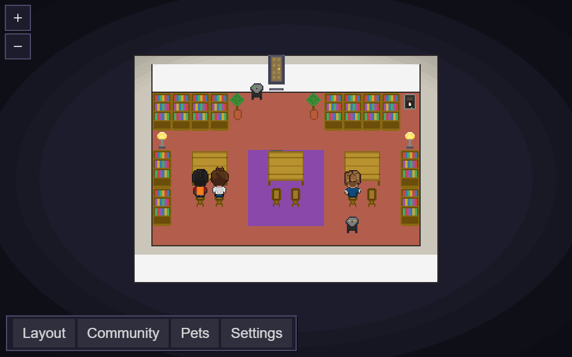
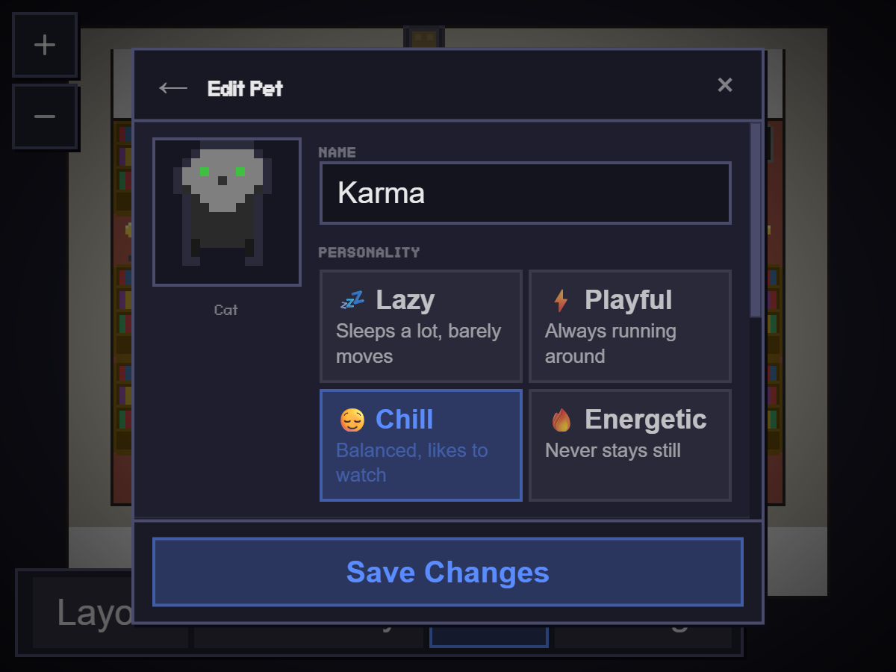
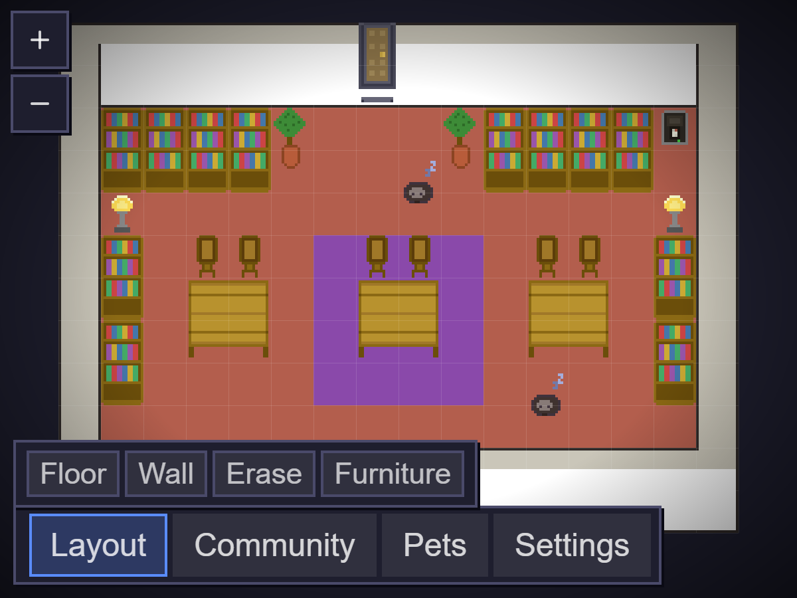
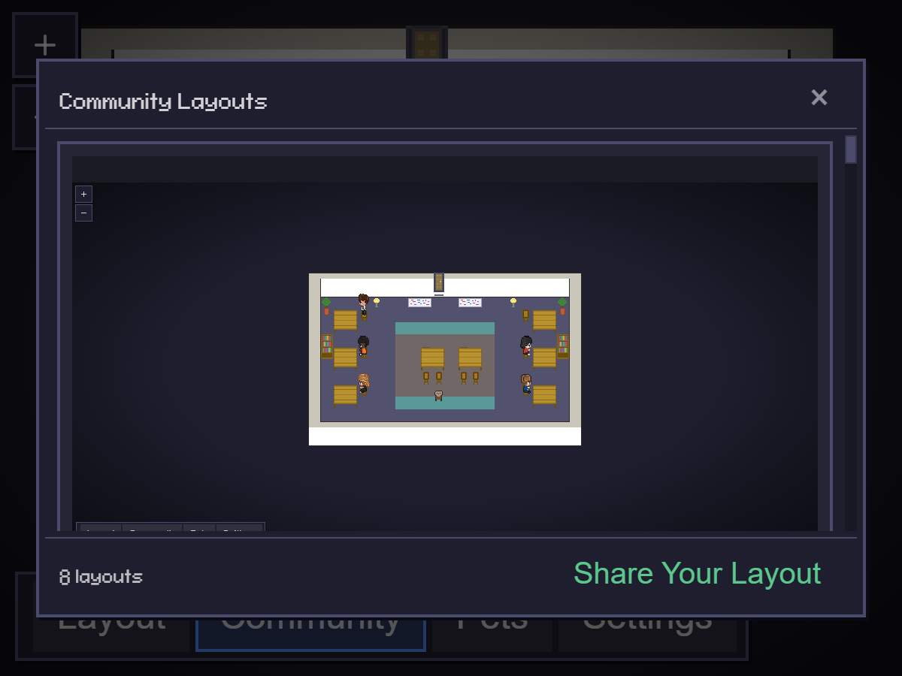
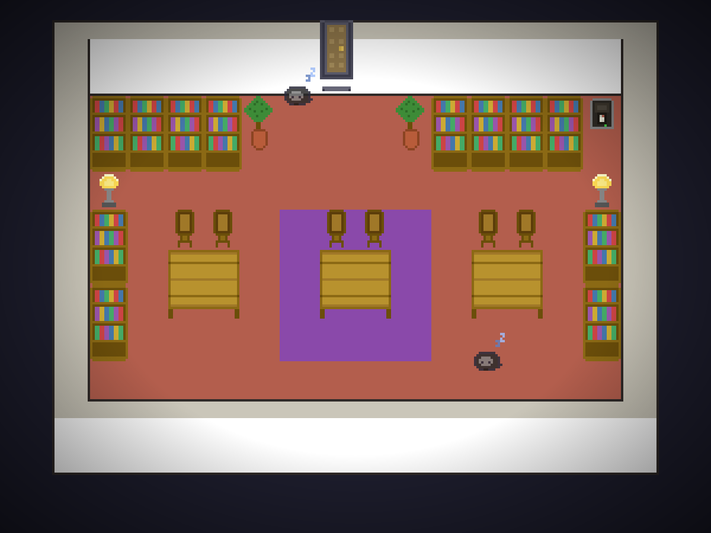

# Pixel Office

> A pixel art virtual office where your AI agents come to life.

Real-time visual dashboard for [Claude Code](https://docs.anthropic.com/en/docs/claude-code) agents. Watch your coding assistants work, wander, and wait — as animated characters in a customizable office.



## Why Pixel Office?

When you're running multiple Claude Code sessions across projects (or machines), it's hard to know what's happening. Pixel Office gives you a single glanceable view:

- **Who's working** — characters sit at desks typing when their agent is active
- **Who's waiting** — speech bubbles appear when an agent needs your approval
- **Who's idle** — characters wander the office between tasks
- **What they're doing** — hover to see the current tool (Read, Edit, Bash, etc.)

Perfect for a wall-mounted monitor, a second screen, or just a corner of your desktop.

## Quick Start

```bash
npm install && cd webview-ui && npm install && cd ..
npm run build
node standalone-server.js
```

Open [http://localhost:3300](http://localhost:3300) — agents appear automatically as you start Claude Code sessions.

For wall displays, use [http://localhost:3300/?kiosk](http://localhost:3300/?kiosk) (auto-framing camera, no UI controls).

## Features

| Feature | Description |
|---|---|
| Standalone server | No VS Code required — just Node.js |
| Auto-discovery | Detects active Claude Code sessions across all projects |
| Live activity | Characters animate based on current tool usage |
| Sub-agents | Task tool spawns child characters near their parent |
| Speech bubbles | Permission (amber dots) and waiting (green check) indicators |
| Sound notifications | Audio chime when an agent finishes and needs attention |
| Office pets | Cats and dogs with customizable colors, patterns, and personalities |
| Door system | Agents enter/exit through doors with matrix spawn animation |
| Break room | Idle agents grab coffee and lounge on the couch |
| Layout editor | Design your office with floors, walls, and 50+ furniture items |
| Community gallery | Browse and import layouts shared by other users |
| Kiosk mode | Auto-framing camera, status sidebar — perfect for wall displays |
| Multi-PC | WebSocket reporters aggregate agents from multiple machines |
| SDK agents | Report custom agents (Claude SDK, cron jobs, any process) |
| VS Code extension | Also works as a panel in VS Code |
| Cross-tab sync | Layout changes sync across all open tabs/windows |
| HTTP API | `/api/status` for monitoring, `/api/reload` for remote control |

### Office Pets

Add cats and dogs to your office. Each pet has customizable colors (body, eyes, nose), coat patterns (solid, striped, spotted, bicolor, tuxedo), and personality traits that affect behavior.



### Layout Editor

Toggle the editor to customize your office:

- **Floor** — 7 tile patterns with HSB color controls
- **Walls** — Auto-tiling with 16 bitmask variants
- **Furniture** — Desks, chairs, monitors, bookshelves, plants, wall art...
- **Rotate** (R) / **Toggle** (T) / **Pick** (eyedropper) / **Drag** to move
- **Undo/Redo** (Ctrl+Z/Y) with 50-level history
- **Export/Import** layouts as JSON



### Community Gallery

Browse layouts shared by the community and import them with one click. Share your own designs via GitHub.



### Kiosk Mode

Full-screen mode with auto-framing camera that follows agent activity. Perfect for wall-mounted monitors.



## Multi-PC Setup

Run a central server on your homeserver and report agents from any machine:

```
 ┌──────────┐     WebSocket      ┌──────────────┐     Browser      ┌─────────┐
 │  Dev PC   │ ──────────────▶  │  Homeserver   │ ◀──────────────  │ Display │
 │ reporter  │   ws://...:3300   │ standalone    │   http://...:3300│ (kiosk) │
 └──────────┘                    └──────────────┘                   └─────────┘
```

**On the central server:**
```bash
node standalone-server.js
```

**On each dev machine:**
```bash
node pixel-office-reporter.js ws://<server-ip>:3300/ws/report
```

The reporter watches local `~/.claude/projects/` JSONL files and streams updates to the server.

**Custom agents (SDK, cron, any process):**
```js
const { createPixelReporter } = require('./reporter-sdk');
const reporter = createPixelReporter({
  serverUrl: 'ws://<server-ip>:3300/ws/report',
  agentName: 'my-agent',
});
reporter.connect();
reporter.taskStart('Processing data');
reporter.toolStart('Bash', { command: 'python analyze.py' });
// ... work ...
reporter.toolEnd('Bash');
reporter.taskEnd();
```

See [docs/standalone.md](docs/standalone.md) for full setup, SDK integration, WebSocket protocol, and API docs.

## Office Assets

The office tileset is **[Office Interior Tileset (16x16)](https://donarg.itch.io/officetileset)** by **Donarg** ($2 on itch.io). Characters are based on **[Metro City](https://jik-a-4.itch.io/metrocity-free-topdown-character-pack)** by **JIK-A-4**.

The tileset is not included in this repo. To import it:

```bash
npm run import-tileset
```

The app works without it — you get characters and a basic layout, but not the full furniture catalog.

## Tech Stack

- **Server**: Node.js, WebSocket (`ws`)
- **Extension**: TypeScript, VS Code Webview API, esbuild
- **Frontend**: React 19, TypeScript, Vite, Canvas 2D
- **Rendering**: Pixel-perfect integer scaling, z-sorted isometric-style sprites

## Roadmap

See [ROADMAP.md](ROADMAP.md) for the full plan. Next: new features.

## License

[MIT](LICENSE) — Based on [Pixel Agents](https://github.com/pablodelucca/pixel-agents) by Pablo De Lucca.
